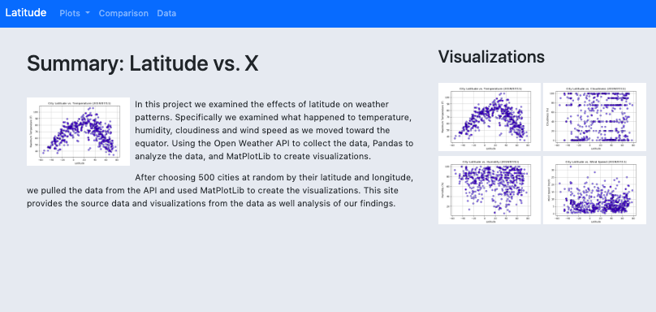

# Latitude-Website

Web visualization dashboard created to display analysis of weather based on the latitude of a city. 
Uses the data analysis from WeatherPy project. 

## Methods Used
* Python
* Pandas
* Matplotlib
* HTML/CSS
* Bootstrap

## Preview

